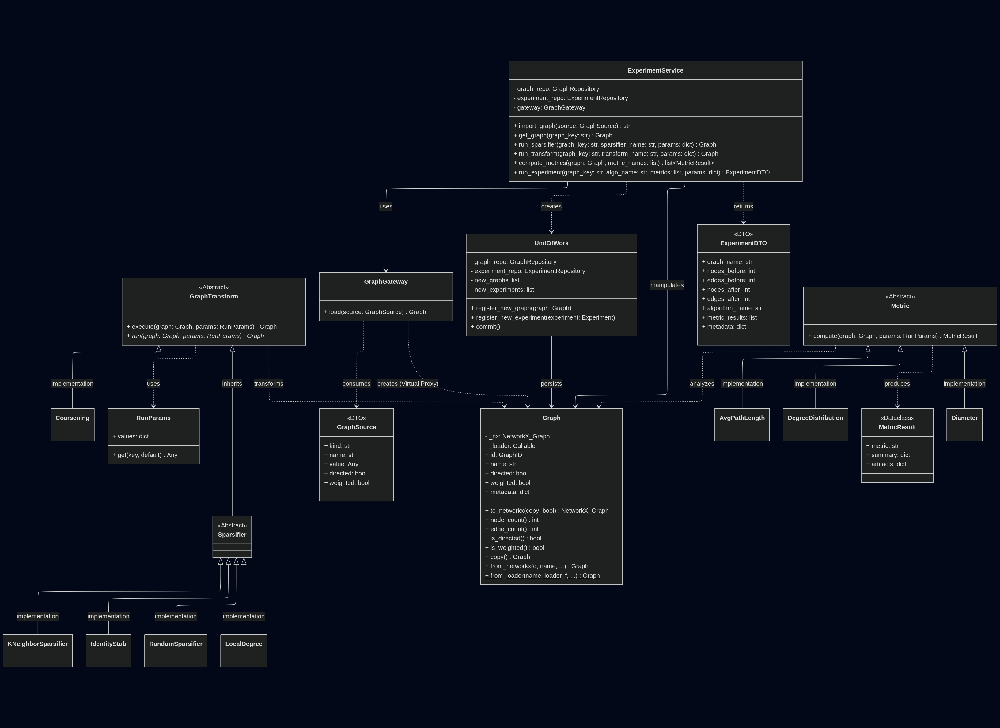

# project description

## user documentation
the framework is designed for the systematic evaluation of graph reduction
algorihtms. users primarily interact with the system through the __experiment facade__
or the provided __demo script__.
- __running the demo__: execute `python src/demo.py` from the root directory
to run a predefined suite of experiments
- __defining scenarios__: users can modify the `SCENARIOS` list in `src/demo.py`
to add new algorithms or change parameters 
- __selecting metrics__: metrics such as `diameter` or `degree_distribution`
can be toggled in the `METRICS` configuration list
- __data input__: place graph files in `src/data/`. the system supports directed and weighted formats
- __visualizations__: if `matblotlib` is installed, comparison plots are generated
automatically in the `results` folder

## installation & configuration
__requirements__: Python 3.9 or higher\
__dependencies__: install required libraries via pip
~~~python
pip install networkx numpy scipy matplotlib
~~~
__configuration__: 
- __graph loading__ - configure `GraphSource` in the script to specify
if a graph should be loaded as directed or weighted 
- __persistence__ - by default, the system uses an `InMemoryGraphRepository`; to 
use persistent storage, implement and swap the repository in the `ExperimentFacade`
- __plugin discovery__ - algorithms and metrics are discovered automatically if they 
are placed in their respective `src/domain/` directories and decorated with `@register_...`

## used design patterns 
| design pattern       | classes                                                                      | justification                                                                                                                                                |
|:---------------------|:-----------------------------------------------------------------------------|:-------------------------------------------------------------------------------------------------------------------------------------------------------------|
| domain model         | `Graph`,  `MetricResult`                                                 | encapsulates the core graph data and behavioral logic   (weight access, node counts, etc.) in rich objects   rather than simple data structures      |
| service layer        | `ExperimentService`                                                          | orchestrates high-level application flows (importing,   running experiments) while keeping the domain logic   independent of infrastructure concerns |
| strategy             | `RandomSparsifier`,  `KNeighborSparsifier`,  `LocalDegreeSparsifier` | allows different graph reduction algorithms to be   interchangeable. the service can call them through   a unified `run()` interface                 |
| unit of work         | `UnitOfWork`                                                                 | tracks all changes to graphs and experiment records   during a transaction, ensuring they are saved atomically   to the repository                   |
| gateway              | `GraphGateway`                                                               | decouples the application from external graph data sources   (files, memory), providing a clean boundary for graph ingestion                             |
| registry             | `SparsifierRegistry`,  `MetricRegistry`,  `TransformRegistry`        | implements a plugin system; allows the framework to dynamically   "discover" and instantiate algorithms by string name                                   |
| lazy load            | `Graph.to_networkx()`                                                        | optimizes memory by only loading the heavy NetworkX object   from disk when a calculation is actually performed                                          |
| data transfer object | `ExperimentDTO`,  `GraphSource`                                          | simple objects used to pass data across layer boundaries   (service to api) without exposing internal domain entities                                    |
| layer supertype      | `GraphTransform`                                                             | provides a common base for all graph algorithms to handle   cross-cutting concerns like execution timing and logging                                     |
| remote facade        | `ExperimentFacade`                                                           | offers a coarse-grained interface for the client, reducing   the number of calls needed to interact with the service layer                               |

## class diagram

